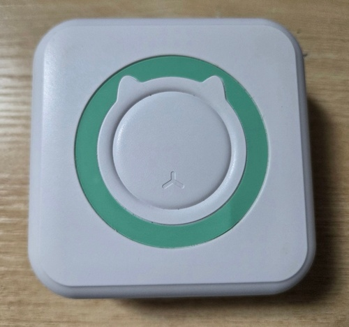
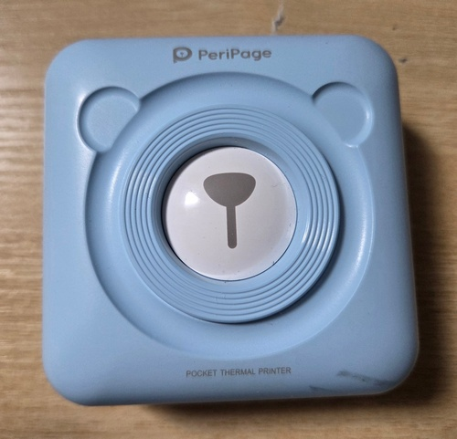
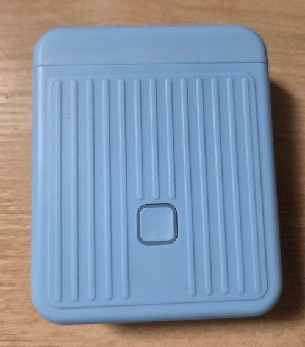

# my-bt-printers

Python tools for printing text and images to small Bluetooth LE (BLE) thermal
printers. A single CLI talks to several printer families through a shared
prepare / calibrate / print interface.

## Supported printers

| Printer | Photo | Print width | Notes |
| --- | --- | --- | --- |
| **MX10 / GT01-like** |  | 384 px | "Cat" receipt printer that advertises `0000ae30` / `0000af30`. [Device notes](docs/devices/MX10.md) |
| **PeriPage A6+** |  | 576 px | Pocket receipt printer that advertises `0000fee7` and writes to `ff02`. [Device notes](docs/devices/Peripage.md) |
| **DOLEWA DL-T01** |  | 96 px | 12 mm × 40 mm BLE label printer using `ffe1` / `ffe2`. [Device notes](docs/devices/DL-T01.md) |

## Setup

```powershell
uv venv --python 3.11
uv pip install --python .\.venv\Scripts\python.exe -e .
```

## Usage

Pick the printer with `--printer` (`mx10`, `peripage`, or `dlt01`). If
`--device` is omitted the CLI auto-discovers a printer by its BLE service UUID;
otherwise pass a BLE name or address. DL-T01 advertisements may omit service
UUIDs, so passing `--device DL-T01` (or its address) is more reliable there.

Scan for nearby BLE devices:

```powershell
.\.venv\Scripts\python.exe -m bt_printers scan --timeout 12
```

Inspect a printer's GATT services:

```powershell
.\.venv\Scripts\python.exe -m bt_printers --printer mx10 inspect --device MX10
```

Print text:

```powershell
.\.venv\Scripts\python.exe -m bt_printers --printer mx10 print-text "Hello" --device CC:10:24:20:88:FF
.\.venv\Scripts\python.exe -m bt_printers --printer peripage print-text "Hello PeriPage" --device 45:54:07:05:8B:91
.\.venv\Scripts\python.exe -m bt_printers --printer dlt01 print-text "DL-T01" --device DL-T01 --align center
```

Print an image:

```powershell
.\.venv\Scripts\python.exe -m bt_printers --printer mx10 print-image .\test\image.jpg --device CC:10:24:20:88:FF
.\.venv\Scripts\python.exe -m bt_printers --printer peripage print-image .\test\image.jpg --device 45:54:07:05:8B:91
```

Common options: `--font` / `--font-size` / `--align` for text, `--binarization`
(`floyd-steinberg` or `threshold`) for images, and `--energy` for darkness.
Add global `--verbose` before the command to print BLE scan/connect/write logs
to stderr.

## Notes

- Text is rendered to a bitmap with Pillow, so non-ASCII text works if a
  suitable font is installed or supplied with `--font`.
- The image is resized to each printer's width (MX10 384 px, PeriPage 576 px,
  DL-T01 96 px). PeriPage caps average raster density before dithering and adds
  trailing feed; MX10 handles trailing paper advance in the device layer.
- DL-T01 targets a 12 mm × 40 mm label (≈96 × 320 dots at 203 DPI). It anchors
  content to the output edge and treats the outer ~1.5 mm of the long axis as an
  unusable safe zone; see [DL-T01 notes](docs/devices/DL-T01.md).
- Increase `--energy` for darker output, decrease it if the paper overheats or
  the print looks too dark (`0` – `0xffff`; DL-T01 maps to density `0` – `6`).

## Project structure

- `bt_printers.base` — abstract `Prepare`, `Calibrate`, and `Print` interfaces.
- `bt_printers.profiles` — `BleProfile` (service/characteristic UUIDs, width).
- `bt_printers.ble` — BLE scanning, inspection, connection, and packet writing.
- `bt_printers.preparation` — shared text/image rasterisation and row conversion.
- `bt_printers.calibration` — shared calibration helpers and data structures.
- `bt_printers.cli` — argument parsing and command dispatch.
- `bt_printers.devices.mx10` / `mx10_protocol` — MX10 profile and command encoder.
- `bt_printers.devices.peripage` / `peripage_protocol` — PeriPage profile and encoder.
- `bt_printers.devices.dlt01` / `dlt01_protocol` — DL-T01 profile and `0x5a` encoder.

Per-device protocol notes live in [`docs/devices`](docs/devices).
